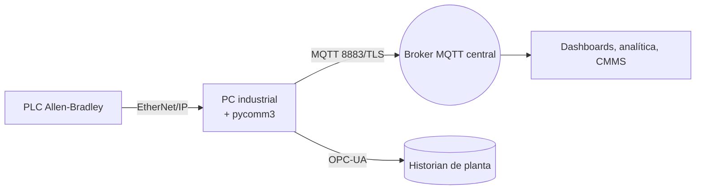

# Conectando PLC Allen-Bradley a la nube con pycomm3 y Node-RED

Los controladores Allen-Bradley siguen siendo el corazón de muchas plantas brownfield que modernizo. Este artículo resume la receta de producción que utilizo para exponer sus datos de proceso casi en tiempo real sin comprometer la integridad del control. La solución combina **pycomm3** para accesos deterministas a tags, **Node-RED** para la orquestación y MQTT para un traspaso seguro entre OT e IT.

## 1. Objetivos y restricciones del proyecto

- Mantener los tiempos de escaneo de ControlLogix y CompactLogix por debajo de los 20 ms.
- Conservar la solución **agnóstica al fabricante** para reutilizar el pipeline de datos en futuras expansiones.
- Ofrecer a los operadores un dashboard local con buffer que continúe funcionando ante caídas del enlace WAN.
- Aplicar TLS, autenticación por certificados y permisos por tópico antes de que cualquier dato abandone la red de planta.

## 2. Arquitectura de referencia



1. **Colector en el edge (Python):** Consulta tags nominados a una cadencia alineada al takt time de la máquina, aplica validaciones y publica cargas en JSON.
2. **Runtime Node-RED:** Gestiona buffer, lógica de reintento y expone un dashboard local para operaciones.
3. **Broker MQTT:** HiveMQ o EMQX con descarga de TLS y políticas de seguridad empresariales.
4. **Consumidores aguas abajo:** Dashboards de negocio, alertas de mantenimiento y conectores ERP.

## 3. Construyendo el colector edge con pycomm3

```python
from datetime import datetime
from pycomm3 import LogixDriver
from paho.mqtt.client import Client
import json, time

TAGS = [
    "Line01.Oven.Temperature",
    "Line01.Oven.AlarmCode",
    "Line01.PackML.State"
]

client = Client(client_id="line01-edge")
client.tls_set(ca_certs="ca.pem", certfile="edge.pem", keyfile="edge.key")
client.username_pw_set("edge-line01", "supersecret")
client.connect("broker.internal", 8883)

with LogixDriver("192.168.10.15/1") as plc:
    while True:
        snapshot = []
        for tag in TAGS:
            value = plc.read(tag).value
            snapshot.append({"tag": tag, "value": value})
        payload = {
            "line": "line01",
            "timestamp": datetime.utcnow().isoformat(),
            "data": snapshot
        }
        client.publish("plant/line01/plc", json.dumps(payload), qos=1, retain=False)
        time.sleep(1)
```

### Buenas prácticas recomendadas

- Realiza **lecturas por lotes** siempre que sea posible para reducir viajes a la red.
- Utiliza **QoS 1** para datos de proceso con estado; reserva QoS 2 para recetas o comandos.
- Separa el tráfico EtherNet/IP en una VLAN dedicada y limita la tasa de publicación MQTT para proteger el controlador.

## 4. Orquestación de flujos en Node-RED

Mi flujo típico contiene cuatro carriles:

1. **Tags entrantes:** Recibe mensajes MQTT y los escribe en InfluxDB para trending.
2. **UI de operación:** Dashboards con gráficos SP/PV, listados de alarmas y widgets de OEE.
3. **Gestión de comandos:** Autentica órdenes remotas, valida rangos y envía escrituras al PLC mediante un microservicio pycomm3.
4. **Monitoreo de salud:** Tópicos de heartbeat, temporizadores watchdog y alertas por e-mail/Teams cuando cesa el flujo de datos.

Incluye el palette `node-red-contrib-cip-ethernet-ip` solo si necesitas interacción directa desde Node-RED; de lo contrario, mantén el tráfico consolidado en Python para facilitar las pruebas unitarias.

## 5. Seguridad y confiabilidad

- **Certificados:** Emite certificados únicos por dispositivo usando tu PKI corporativa; rota automáticamente con SCEP o Vault.
- **Buffer fuera de línea:** Implementa una caché local en SQLite o InfluxDB para que el nodo edge conserve hasta un turno de datos durante cortes WAN.
- **Gestión de cambios:** Versiona listas de tags, esquemas de payload y exportaciones de flujos; trata el gateway como software de producción.
- **Diagnósticos:** Publica métricas (CPU, RAM, pérdida de paquetes) bajo un árbol de tópicos `/sys` para mantenimiento proactivo.

## 6. Lista de verificación de puesta en marcha

- Valida nombres y tipos de datos con el ingeniero de control.
- Ejecuta una prueba de conmutación por falla (failover) desconectando la WAN y comprobando que la planta siga operando.
- Revisa las reglas de firewall para que solo queden abiertos MQTT/TLS y puertos de diagnóstico OT.
- Capacita a los operadores en los nuevos dashboards y rutas de escalamiento.

## 7. Lecciones aprendidas

Los despliegues más exitosos combinan una implementación incremental (una celda de producción por vez) con una clara asignación de responsabilidades entre control, IT y analítica. Al respetar los presupuestos de scan-time y tratar el gateway edge como infraestructura crítica, desbloquearás insights en la nube mientras mantienes los PLC Allen-Bradley impecables en el piso de planta.
