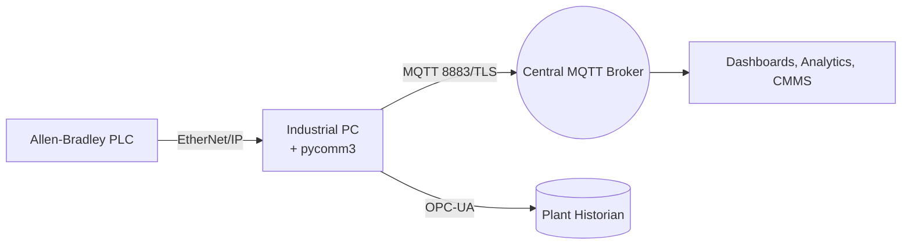

# Connecting Allen‑Bradley PLCs to the Cloud with pycomm3 and Node‑RED

Allen‑Bradley controllers still sit at the heart of many brownfield plants I modernize. This article documents the production recipe I use to expose their process data in near real time without compromising control integrity. It combines **pycomm3** for deterministic tag access, **Node‑RED** for orchestration, and MQTT for secure OT/IT handoff.

## 1. Project Goals and Constraints

- Maintain ControlLogix and CompactLogix scan times below 20 ms.
- Keep the solution **vendor-agnostic** so future upgrades can reuse the data pipeline.
- Offer operators a buffered local dashboard that keeps running if the WAN link drops.
- Enforce TLS, certificate authentication, and role-based topic permissions before anything leaves the plant network.

## 2. Architecture Overview



1. **Edge Collector (Python):** Polls named tags at a cadence aligned with machine takt time, applies validation, and publishes JSON payloads.
2. **Node‑RED Runtime:** Manages buffering, retry logic, and exposes a local dashboard for operations.
3. **MQTT Broker:** HiveMQ or EMQX with TLS offload and enterprise security policies.
4. **Downstream Consumers:** Business intelligence dashboards, maintenance alerts, and ERP connectors.

## 3. Building the Edge Collector with pycomm3

```python
from datetime import datetime
from pycomm3 import LogixDriver
from paho.mqtt.client import Client
import json, time

TAGS = [
    "Line01.Oven.Temperature",
    "Line01.Oven.AlarmCode",
    "Line01.PackML.State"
]

client = Client(client_id="line01-edge")
client.tls_set(ca_certs="ca.pem", certfile="edge.pem", keyfile="edge.key")
client.username_pw_set("edge-line01", "supersecret")
client.connect("broker.internal", 8883)

with LogixDriver("192.168.10.15/1") as plc:
    while True:
        snapshot = []
        for tag in TAGS:
            value = plc.read(tag).value
            snapshot.append({"tag": tag, "value": value})
        payload = {
            "line": "line01",
            "timestamp": datetime.utcnow().isoformat(),
            "data": snapshot
        }
        client.publish("plant/line01/plc", json.dumps(payload), qos=1, retain=False)
        time.sleep(1)
```

### Recommended Practices

- **Batch reads** when possible to minimize roundtrips.
- Use **QoS 1** for stateful process data; reserve QoS 2 for recipes or commands.
- Segment EtherNet/IP traffic on a dedicated VLAN and rate-limit MQTT publishes to protect the controller.

## 4. Orchestrating Node‑RED Flows

My typical flow contains four swimlanes:

1. **Inbound Tags:** Receives MQTT messages and writes to InfluxDB for trending.
2. **Operator UI:** Dashboards with SP/ PV charts, alarm lists, and OEE widgets.
3. **Command Handling:** Authenticates remote commands, validates ranges, and sends writes back to the PLC through a pycomm3 microservice.
4. **Health Monitoring:** Heartbeat topics, watchdog timers, and e-mail/Teams notifications when data stops flowing.

Include the `node-red-contrib-cip-ethernet-ip` palette only if you need direct interactions from Node‑RED; otherwise keep traffic consolidated in Python for easier unit testing.

## 5. Security and Reliability

- **Certificates:** Issue unique device certificates via your corporate PKI; rotate them automatically with SCEP or Vault.
- **Offline Buffering:** Implement a local SQLite or InfluxDB cache so the edge node keeps up to one shift of data during WAN outages.
- **Change Management:** Version-control your tag lists, payload schemas, and flow exports; treat the gateway like production software.
- **Diagnostics:** Publish metrics (CPU, RAM, packet loss) under a `/sys` topic tree for proactive maintenance.

## 6. Commissioning Checklist

- Validate tag names and data types with the controls engineer.
- Perform a failover test by unplugging the WAN and ensuring the plant keeps running.
- Review firewall rules so only MQTT/TLS and OT diagnostic ports are open.
- Train operators on the new dashboards and escalation paths.

## 7. Lessons Learned

The most successful rollouts pair incremental deployment (one production cell at a time) with clear ownership between controls, IT, and analytics teams. By respecting scan-time budgets and treating the edge gateway as critical infrastructure, you can unlock cloud insights while keeping Allen‑Bradley PLCs rock-solid on the plant floor.
