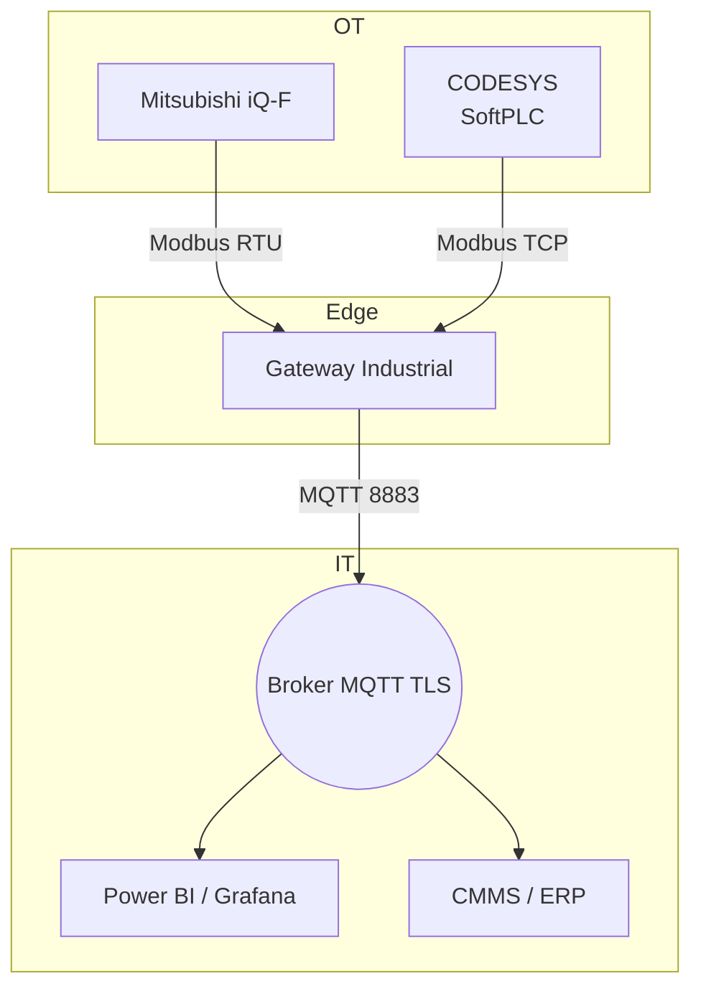

# Conectando PLC Mitsubishi y CODESYS a la Nube con Modbus

Integrar líneas de producción que mezclan controladores Mitsubishi con proyectos CODESYS es un escenario habitual en las plantas que digitalizo. Este artículo resume el procedimiento que me ha permitido entregar datos confiables a la nube sin reescribir lógicas existentes y respetando las normas de ciberseguridad industrial.

## 1. Panorama General

- **Objetivo:** Normalizar variables críticas en un esquema de tópicos MQTT y dashboards unificados.
- **Restricciones:** Mantener comunicación determinista con estaciones antiguas RS-485 y, a la vez, aprovechar Ethernet en celdas nuevas.
- **Herramientas principales:** `GX Works3`, `CODESYS 3.5`, `pymodbus`, `Node-RED`, Mosquitto/HiveMQ.

## 2. Diseño de la Arquitectura



El gateway corre Docker con contenedores dedicados: un servicio Python para cada familia de PLC y una instancia Node-RED que normaliza las cargas útiles.

## 3. Configuración en Mitsubishi

1. Habilita el módulo Modbus (serie FX5 o Q). Define dirección esclavo, velocidad y paridad.
2. Mapea registros de holding `D` o `R` a direcciones Modbus; documenta escalas y unidades.
3. Agrega un bit de watchdog (`M9000`) que se alterna cada segundo para monitorear vida.

## 4. Configuración en CODESYS

1. Inserta un dispositivo **Modbus TCP Slave** si publicarás datos, o Master si necesitarás leer de terceros.
2. Utiliza la librería `IoDrvModbus` y vincula variables con `%MW` / `%MD` para garantizar alineación de datos.
3. Expone un bloque estructurado (por ejemplo, `ST_MachineStatus`) para agrupar valores relacionados.

## 5. Código de Integración en Python

```python
from pymodbus.client import ModbusSerialClient, ModbusTcpClient
from paho.mqtt.client import Client
import json, time

mitsubishi = ModbusSerialClient(method="rtu", port="/dev/ttyUSB0", baudrate=19200, parity="E", stopbits=1)
codesys = ModbusTcpClient(host="192.168.20.25", port=502)

mqtt = Client(client_id="gateway-linea2")
mqtt.tls_set(ca_certs="ca.pem", certfile="gateway.pem", keyfile="gateway.key")
mqtt.username_pw_set("linea2", "clave")
mqtt.connect("broker.planta", 8883)

while True:
    temp = mitsubishi.read_holding_registers(40010, 2, unit=1).registers
    status = codesys.read_input_registers(30050, 4, unit=3).registers

    payload = {
        "linea": "2",
        "timestamp": time.time(),
        "horno": temp[0] / 10,
        "packml": status[0],
        "alarmed": bool(status[1])
    }
    mqtt.publish("planta/linea2/status", json.dumps(payload), qos=1, retain=False)
    time.sleep(1)
```

## 6. Normalización en Node-RED

- Establece un flujo que valide rangos (por ejemplo, temperaturas entre 0 y 250 °C).
- Convierte los datos en unidades de ingeniería y crea dashboards con `node-red-dashboard`.
- Configura un subflujo reutilizable que genere alarmas cuando el bit de watchdog no cambie durante 10 segundos.

## 7. Seguridad y Gobernanza

- Segmenta redes con VLAN OT/IT y firewalls con listas blancas de IP.
- Implementa autenticación mutua MQTT (certificados por dispositivo) y políticas ACL.
- Documenta el modelo de datos compartido y publícalo en un repositorio Git para controlar cambios.

## 8. Puesta en Marcha y Seguimiento

1. Ejecuta pruebas de FAT con simuladores Modbus antes de tocar la planta.
2. Durante el SAT, captura paquetes con Wireshark para verificar tiempos de respuesta.
3. Capacita a mantenimiento en cómo reiniciar contenedores y revisar logs.
4. Revisa semanalmente los dashboards de OEE y los registros de auditoría para detectar anomalías.

Con esta metodología, logré que dos líneas con tecnología heterogénea compartieran indicadores en menos de tres semanas de proyecto, manteniendo la confiabilidad de los PLC y abriendo la puerta a análisis predictivos en la nube.
