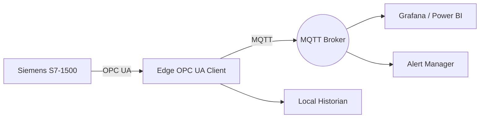

# Connecting Siemens PLCs to the Cloud with OPC UA and MQTT

Siemens S7 controllers are exceptionally capable, yet many plants still treat them as closed boxes. The following workflow shows how I surface their insights using OPC UA, MQTT, and secure edge computing without rewriting existing Step 7 logic.

## 1. When to Use OPC UA vs. Native DB Reads

| Scenario                       | Recommended Interface                       |
| ------------------------------ | ------------------------------------------- |
| Modern S7-1500 firmware ≥ V2.8 | Native OPC UA server with companion specs   |
| Legacy S7-300/400              | S7comm or RFC1006 via an industrial gateway |
| High-frequency motion data     | Direct DB block reads over PROFINET         |

I prefer OPC UA whenever possible because it exposes metadata (engineering units, ranges) and supports built-in security profiles.

## 2. Reference Architecture



- **Edge Hardware:** Industrial PC running Ubuntu Core.
- **Software Stack:** `python-opcua`, Node-RED, InfluxDB, Telegraf.
- **Security:** Siemens certificates generated in TIA Portal, TLS mutual authentication to the broker, VPN for remote access.

## 3. Browsing and Subscribing to OPC UA Nodes

```python
from opcua import Client
from paho.mqtt.client import Client as MQTT
import json

ua_client = Client("opc.tcp://192.168.2.10:4840")
ua_client.set_user("ua_reader")
ua_client.set_password("secret")
ua_client.load_client_certificate("ua_client.crt")
ua_client.load_private_key("ua_client.key")
ua_client.connect()

mqtt = MQTT("siemens-edge")
mqtt.tls_set("ca.pem", "edge.pem", "edge.key")
mqtt.connect("broker.plant", 8883)

nodes = {
    "temperature": ua_client.get_node("ns=4;s=Line01/Oven/Temperature"),
    "pressure": ua_client.get_node("ns=4;s=Line01/Oven/Pressure"),
    "state": ua_client.get_node("ns=4;s=Line01/PackML/State")
}

handler = ua_client.create_subscription(500, None)

while True:
    snapshot = {name: float(node.get_value()) for name, node in nodes.items()}
    mqtt.publish("plant/line01/siemens", json.dumps(snapshot), qos=1)
```

### Tips from Commissioning

- Export the OPC UA address space to CSV during FAT so analytics teams can plan dashboards early.
- Set sampling intervals slightly higher than PLC cycle time to avoid overwhelming the CPU (e.g., 250 ms for a 120 ms cycle).
- Use Siemens’ built-in **Rate Limiting** to ensure UA clients cannot exceed defined publish intervals.

## 4. Node-RED Flow Highlights

1. **MQTT In → Function:** Validates payloads, applies conversions (°C to °F), and tags events with shift information.
2. **InfluxDB Out:** Stores 30 days of high-resolution data locally for troubleshooting.
3. **Dashboard:** Provides OT-friendly view with alarm acknowledgements and manual override logs.
4. **Webhook:** Forwards anomalies to Microsoft Teams with enriched context (operator, machine, recipe).

## 5. Security Hardening

- **Certificates:** Use separate certificates for engineering and production clients. Revoke them instantly when contractors finish.
- **User Management:** Map OPC UA roles to service accounts; disable anonymous access.
- **Network:** Place the S7 PLC on an OT VLAN and expose only the edge gateway to the IT network through a stateful firewall.
- **Audit:** Log MQTT publishes with correlation IDs to trace changes back to their source.

## 6. Operational Results

Once deployed, the plant team gained:

- Live OEE dashboards and downtime Pareto charts updated every minute.
- Condition monitoring rules that email maintenance when a temperature trend deviates from historical baselines.
- The ability to replay OPC UA data in simulation mode for training new operators.

By modernizing the data interface while respecting Siemens best practices, you can unlock advanced analytics without touching the control code that keeps your factory running.
