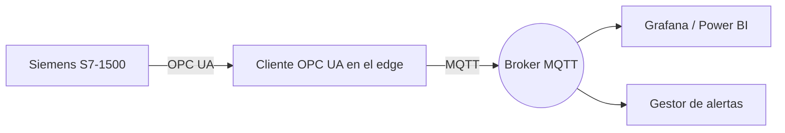

# Conectando PLC Siemens a la nube con OPC UA y MQTT

Los controladores Siemens S7 son extremadamente capaces, pero muchas plantas aún los tratan como cajas cerradas. El siguiente flujo de trabajo muestra cómo libero su información usando OPC UA, MQTT y edge computing seguro sin reescribir la lógica existente en Step 7.

## 1. Cuándo usar OPC UA vs. lecturas directas de DB

| Escenario | Interfaz recomendada |
| --- | --- |
| Firmware S7-1500 moderno ≥ V2.8 | Servidor OPC UA nativo con companion specs |
| S7-300/400 legado | S7comm o RFC1006 mediante un gateway industrial |
| Datos de movimiento de alta frecuencia | Lecturas directas de bloques DB sobre PROFINET |

Prefiero OPC UA siempre que sea posible porque expone metadatos (unidades de ingeniería, rangos) y soporta perfiles de seguridad integrados.

## 2. Arquitectura de referencia



- **Capa OT:** El PLC S7-1500 publica nodos OPC UA con certificados firmados.
- **Gateway edge:** Un industrial PC ejecuta un cliente OPC UA, aplica reglas de negocio y publica payloads MQTT.
- **Nube/TI:** Dashboards, notificaciones y almacenamiento histórico consumen los tópicos.

## 3. Duro vs. blando: ajustar el modelo de datos

1. Define un namespace OPC UA claro: agrupa tags por celda/máquina y documenta unidades.
2. Expone bloques DB críticos como `Structures` para evitar colecciones de bits sin contexto.
3. Crea mapas de tópicos MQTT alineados a ISA-95 (`planta/linea/celda/variable`).

## 4. Configuración de seguridad

- **Certificados:** Crea certificados X.509 únicos para el PLC y el gateway; importa los trust lists en ambos extremos.
- **Roles OPC UA:** Limita los permisos de browse/leer/escribir al usuario del gateway.
- **MQTT:** Forza TLS 1.2+, autenticación mutuamente certificada y ACLs que restrinjan publicación/suscripción.

## 5. Ejemplo de cliente OPC UA en el edge

```python
from asyncua import Client
from paho.mqtt.client import Client as MqttClient
import asyncio, json, ssl

NODES = {
    "temperatura": "ns=4;s=Line1.Oven.Temperature", 
    "estado": "ns=4;s=Line1.PackML.State",
    "alarma": "ns=4;s=Line1.Oven.AlarmCode"
}

async def read_and_publish():
    async with Client("opc.tcp://192.168.1.10:4840") as opc:
        mqtt = MqttClient(client_id="edge-s7")
        mqtt.tls_set(certfile="edge.pem", keyfile="edge.key", ca_certs="ca.pem", cert_reqs=ssl.CERT_REQUIRED)
        mqtt.username_pw_set("edge-s7", "clave")
        mqtt.connect("broker.planta", 8883)

        while True:
            snapshot = {}
            for key, node_id in NODES.items():
                node = opc.get_node(node_id)
                snapshot[key] = await node.read_value()
            mqtt.publish("planta/linea1/s7", json.dumps(snapshot), qos=1)
            await asyncio.sleep(1)

asyncio.run(read_and_publish())
```

## 6. Integración con sistemas existentes

- **SCADA WinCC / Ignition:** Suscribe a los tópicos MQTT o al servidor OPC UA según corresponda para mantener visibilidad en planta.
- **Historiadores:** Guarda los payloads en InfluxDB, TimescaleDB o PI System según los SLA de retención.
- **BI y analítica:** Al reutilizar MQTT, puedes conectar Power BI, Grafana o Snowflake sin cargar al PLC.

## 7. Puesta en marcha y monitoreo

1. Ejecuta pruebas FAT con simuladores OPC UA para validar certificados y modelos de datos.
2. Durante el SAT, mide jitter de publicación y latencia en la red para asegurar que no interfiere con PROFINET.
3. Configura dashboards que vigilen la salud del gateway (uso de CPU, reconexiones, errores de certificado).
4. Documenta el flujo de datos y entrena a operaciones en cómo actuar ante alarmas y alertas MQTT.

## 8. Conclusiones

La combinación OPC UA + MQTT me permite liberar la información de los PLC Siemens sin tocar la lógica Step 7 que ya funciona. Al reforzar la seguridad, modelar los datos con intención y monitorear continuamente el gateway, obtienes visibilidad en tiempo real mientras mantienes el control determinista intacto.
