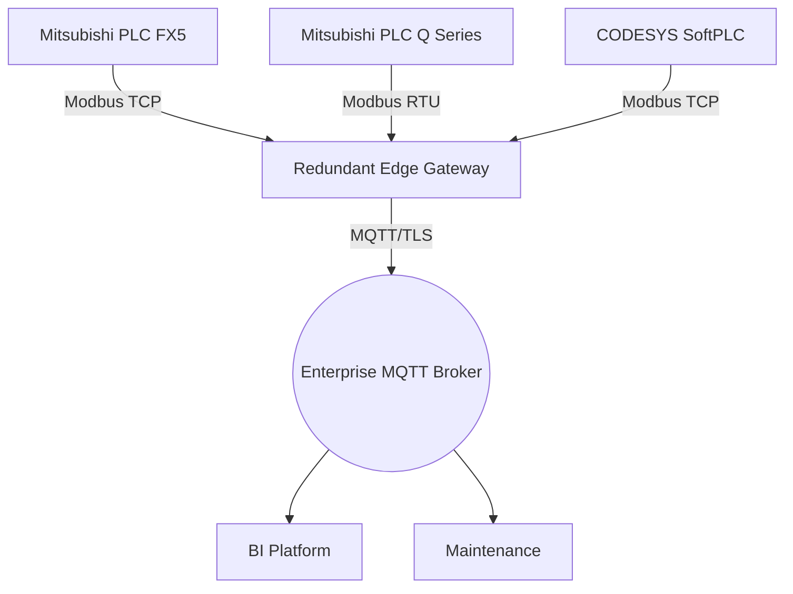

# Connecting Mitsubishi and CODESYS PLCs to the Cloud (Modbus Focus)

A packaging customer asked me to deliver consolidated dashboards across three production lines—two driven by Mitsubishi PLCs and one powered by a CODESYS soft controller. Rather than replace hardware, we stitched everything together with Modbus and a hardened edge gateway. Here is the playbook I followed.

## 1. Requirements Gathering

- Synchronize machine states in a shared OEE data model (availability, performance, quality).
- Collect energy metrics for cost allocation.
- Leave existing ladder and structured text untouched to avoid recertification.
- Ensure IT receives metrics via MQTT over TLS with detailed audit logs.

## 2. Normalized Data Model

I start every engagement by defining the payload schema. Below is a simplified JSON contract agreed upon with operations and IT:

```json
{
  "line": "L2",
  "timestamp": "2025-06-25T14:53:00Z",
  "packml": {
    "state": "EXECUTE",
    "mode": "PRODUCTION",
    "good_count": 1532,
    "reject_count": 8
  },
  "energy": {
    "voltage": 480,
    "current": 32.5,
    "power_factor": 0.92
  },
  "alarms": [
    {"code": 201, "severity": "high", "message": "Infeed door open"}
  ]
}
```

Having this structure early allowed the controls team to map PLC registers accurately and the analytics team to design dashboards before deployment.

## 3. Gateway Layout



The gateway is an industrial PC running Proxmox with two Ubuntu VMs configured in an active/standby pair. Keepalived floats a virtual IP, so the OT network always connects to the available node.

## 4. Polling Strategy

- **Scan Group A (Every 1 s):** PackML states, throughput counters, energy readings.
- **Scan Group B (Every 5 s):** Temperature, pressure, humidity sensors.
- **Scan Group C (On Demand):** Recipe information triggered from the ERP via MQTT RPC.

By grouping addresses this way, we avoided saturating slower serial links while still capturing fast-changing KPIs.

## 5. Python Collector Example

```python
from pymodbus.client import ModbusTcpClient, ModbusSerialClient
from paho.mqtt.client import Client
import json, time

mitsubishi_tcp = ModbusTcpClient(host="192.168.100.11")
energy_serial = ModbusSerialClient(method="rtu", port="/dev/ttyUSB0", baudrate=9600, parity="E")
codesys = ModbusTcpClient(host="192.168.100.45")

mqtt = Client(client_id="edge-packaging")
mqtt.tls_set("ca.pem", "edge.pem", "edge.key")
mqtt.username_pw_set("edge", "edgepass")
mqtt.connect("broker.internal", 8883)

while True:
    line_state = mitsubishi_tcp.read_holding_registers(40000, 10, unit=1)
    codesys_state = codesys.read_holding_registers(40000, 10, unit=3)
    energy = energy_serial.read_input_registers(30000, 6, unit=5)

    payload = {
        "line": "L2",
        "timestamp": time.time(),
        "packml": {
            "state": line_state.registers[0],
            "mode": line_state.registers[1],
            "good_count": line_state.registers[4],
            "reject_count": line_state.registers[5]
        },
        "energy": {
            "voltage": energy.registers[0] / 10,
            "current": energy.registers[1] / 10,
            "power_factor": energy.registers[2] / 100
        },
        "alarms": codesys_state.registers[6:10]
    }
    mqtt.publish("factory/packaging/l2", json.dumps(payload), qos=1, retain=False)
    time.sleep(1)
```

## 6. Reliability Add-ons

- **Store-and-Forward:** Redis queue persists payloads if the MQTT broker is unreachable.
- **Dual Power Supplies:** Each gateway VM sits on a UPS; the PLC network remains alive during short outages.
- **Self-Diagnostics:** A `/health` topic reports poll duration, Modbus errors, and MQTT latency.
- **Automatic Tag Generation:** Scripts parse GX Works and CODESYS symbol exports to keep documentation synchronized.

## 7. Results and Next Steps

Within the first month, the factory gained:

- Unified OEE reporting per shift and per SKU.
- Early detection of pneumatic leaks thanks to correlated energy vs. throughput data.
- Shorter troubleshooting time because maintenance could replay the last 24 hours of process values.

Future phases include adding Sparkplug B payloads and feeding a machine learning model for predictive maintenance. By respecting each controller’s strengths and using Modbus as the common language, we achieved cloud visibility without disrupting production.
