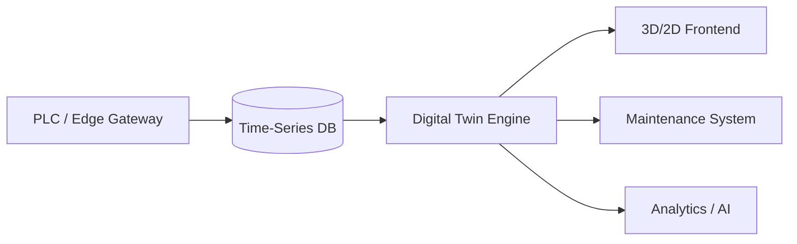

# Digital Twins for Practical Maintenance: A Roadmap

Digital twins are often treated as shiny demos. In my projects, they become everyday tools because we build them with maintenance outcomes in mind. This roadmap distills the steps I follow to deliver digital twins that improve uptime without overwhelming teams.

## 1. Clarify the Maintenance Use Cases

Start with scenarios the maintenance crew faces weekly:

- Diagnosing intermittent faults that only appear under specific operating conditions.
- Training new technicians without risking production.
- Planning corrective actions during scheduled downtime.

If a use case does not reduce downtime, improve safety, or accelerate training, it stays out of scope.

## 2. Build a Trustworthy Data Foundation

1. **Tag Mapping:** Export PLC symbol tables and align them with equipment hierarchies (ISA-95, asset IDs).
2. **Data Quality Checks:** Validate sensor ranges, units, and sampling rates; log anomalies to an exception queue.
3. **Historian Synchronization:** Store high-resolution data locally to support replay features, while pushing aggregates to the cloud for analytics.

## 3. Model the System Incrementally

- **Level 0 — Connectivity Twin:** Mirrors current sensor/actuator values and alarms. Useful for remote troubleshooting.
- **Level 1 — Behavior Twin:** Adds physics-based or data-driven models (e.g., pump curves, thermal models) to predict near-term states.
- **Level 2 — Scenario Twin:** Enables what-if simulations to evaluate maintenance procedures or recipe changes.

Each level should only be attempted when the previous one delivers value and has user adoption.

## 4. Toolchain Example

- **Twin Engine:** I often use TwinCAT Analytics or custom Python microservices running state-space models.
- **Frontend:** Combine a lightweight 3D model (Unity WebGL or Three.js) with 2D dashboards built in Grafana or Power BI.
- **Integration:** Bidirectional APIs with the CMMS (e.g., Fiix, UpKeep) to open work orders directly from the twin.

## 5. Bringing Maintenance into the Loop

- Conduct workshops with technicians to map real pain points and validate UI mockups.
- Record expert troubleshooting sessions and embed them as guided procedures within the twin.
- Implement feedback widgets so teams can request new scenarios or report missing tags.

## 6. Key Metrics to Track

| KPI                          | Definition                                              | Target                    |
| ---------------------------- | ------------------------------------------------------- | ------------------------- |
| Mean Time to Diagnose (MTTD) | Average time to identify root cause                     | Reduce by 30% in 6 months |
| Training Efficiency          | Time for a new tech to complete first solo intervention | Reduce by 25%             |
| Downtime Avoidance           | Hours saved by planning maintenance using the twin      | Track monthly             |

## 7. Governance and Security

- Use role-based access control; maintenance can view/annotate, engineering can modify models, IT manages infrastructure.
- Version twin models just like control code; every release should be tested in a staging environment.
- Encrypt traffic between the twin engine and frontends, especially when exposing remote access.

## 8. Success Story Snapshot

For a food processing plant, we built a level 2 twin of a thermal tunnel oven. Maintenance could rehearse burner tuning before entering the hot zone, cutting downtime per adjustment from 2 hours to 35 minutes. The twin also flagged airflow imbalances early, preventing product quality issues.

Digital twins deliver results when we treat them as operational tools, not just visualization projects. Start with the maintenance outcomes, iterate with technicians, and keep data quality front and center.
