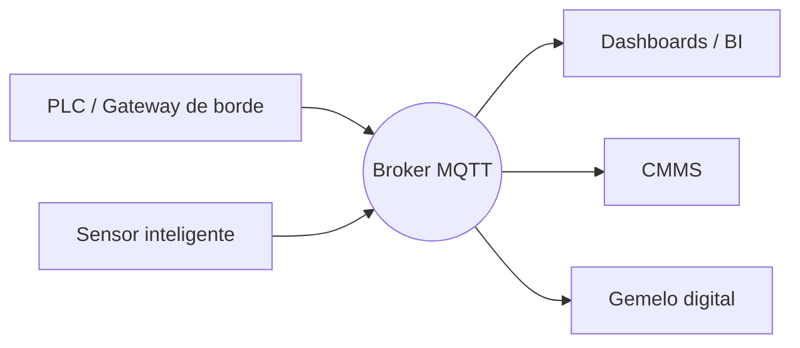

# Fundamentos de MQTT: publish/subscribe, brokers y clientes

MQTT es mi protocolo de cabecera para conectar equipos de planta con plataformas analíticas. Su modelo publish/subscribe desacopla productores y consumidores, ideal para unir OT e IT. Así encajan las piezas en despliegues reales.

## 1. Publish/subscribe en palabras simples

- **Publishers** envían mensajes a tópicos (p. ej., `planta/linea1/horno`).
- **Subscribers** reciben mensajes de los tópicos que les interesan.
- **Broker** se ubica en medio, autentica clientes, enruta mensajes y puede retener el último valor.

A diferencia de protocolos request/response, los publicadores y suscriptores no necesitan conocerse, lo que simplifica el escalado.

## 2. Diagrama de arquitectura MQTT



## 3. Calidad de servicio (QoS)

- **QoS 0:** “Como máximo una vez” – mejor esfuerzo. Úsalo para telemetría no crítica.
- **QoS 1:** “Al menos una vez” – requiere acuse. Útil para valores de proceso y alarmas.
- **QoS 2:** “Exactamente una vez” – handshake de dos fases. Resérvalo para comandos o transacciones sensibles.

Elige QoS por tópico según criticidad y estabilidad de red.

## 4. Ejemplo de cliente

```python
import json
from paho.mqtt.client import Client

client = Client(client_id="edge-linea1")
client.tls_set("ca.pem", "edge.pem", "edge.key")
client.username_pw_set("linea1", "pass")
client.connect("broker.planta", 8883)

client.publish("planta/linea1/temperatura", json.dumps({"valor": 87.5}), qos=1)
client.subscribe("planta/linea1/comandos/#", qos=1)
```

## 5. Mensajes retenidos y Last Will

- **Retained Messages:** El broker almacena el último mensaje de un tópico. Perfecto para dashboards que necesitan un valor inmediato.
- **Last Will and Testament:** Configura a los clientes para anunciar desconexiones inesperadas y alertar al mantenimiento.

## 6. Consejos de diseño de tópicos

- Usa jerarquías: `planta/linea/estacion/parametro`.
- Reserva prefijos para monitoreo del sistema (`planta/linea1/_sys/heartbeat`).
- Evita espacios y mantén los tópicos en minúsculas para consistencia.

## 7. Esenciales de seguridad

- Obliga TLS con certificados de cliente.
- Usa ACL para restringir qué tópicos puede publicar/suscribirse cada cliente.
- Rota credenciales y certificados periódicamente.
- Monitorea conteo de conexiones y tasas de publicación anómalas.

## 8. Estrategias de escalado

- Despliega brokers en clúster (HiveMQ, EMQX, Mosquitto con bridging) para redundancia.
- Usa suscripciones compartidas para balancear carga en consumidores.
- Integra con IAM empresarial para gestionar usuarios centralizadamente.

## 9. Puente entre OT e IT

Combina MQTT con gateways edge que normalizan datos de PLC en payloads estructurados. Servicios aguas abajo—dashboards, CMMS, machine learning—consumen los mismos streams sin integraciones punto a punto.

La simplicidad de MQTT esconde su potencia. Con diseño disciplinado de tópicos, selección de QoS y controles de seguridad, se convierte en la columna vertebral de arquitecturas IIoT resilientes.
