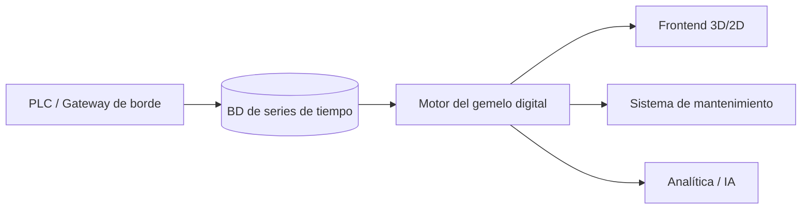

# Gemelos digitales para mantenimiento práctico: una hoja de ruta

Los gemelos digitales suelen verse como demos llamativas. En mis proyectos se convierten en herramientas de uso diario porque se diseñan pensando en los resultados de mantenimiento. Esta hoja de ruta resume los pasos que sigo para entregar gemelos que mejoran la disponibilidad sin saturar a los equipos.

## 1. Aclara los casos de uso de mantenimiento

Empieza con los escenarios que enfrenta el equipo cada semana:

- Diagnosticar fallas intermitentes que aparecen bajo condiciones específicas.
- Capacitar técnicos nuevos sin poner en riesgo la producción.
- Planificar acciones correctivas durante paradas programadas.

Si un caso de uso no reduce tiempos muertos, mejora la seguridad o acelera la capacitación, queda fuera del alcance.

## 2. Construye una base de datos confiable

1. **Mapeo de tags:** Exporta tablas de símbolos del PLC y alinéalas con la jerarquía de equipos (ISA-95, IDs de activo).
2. **Verificación de calidad:** Valida rangos, unidades y frecuencias de muestreo; registra anomalías en una cola de excepciones.
3. **Sincronización con el historiador:** Almacena datos de alta resolución localmente para soportar repeticiones, y envía agregados a la nube para analítica.

## 3. Modela el sistema de forma incremental

- **Nivel 0 — gemelo de conectividad:** Refleja valores actuales de sensores/actuadores y alarmas. Útil para diagnóstico remoto.
- **Nivel 1 — gemelo de comportamiento:** Añade modelos físicos o basados en datos (curvas de bombas, modelos térmicos) para predecir estados a corto plazo.
- **Nivel 2 — gemelo de escenarios:** Permite simulaciones “what-if” para evaluar procedimientos de mantenimiento o cambios de receta.

Solo avanza al siguiente nivel cuando el anterior entrega valor y cuenta con adopción.

## 4. Ejemplo de toolchain

- **Motor del gemelo:** Uso TwinCAT Analytics o microservicios Python con modelos de espacio de estados.
- **Frontend:** Combino un modelo 3D ligero (Unity WebGL o Three.js) con tableros 2D construidos en Grafana o Power BI.
- **Integración:** APIs bidireccionales con el CMMS (Fiix, UpKeep) para abrir órdenes de trabajo directamente desde el gemelo.

## 5. Involucra a mantenimiento

- Realiza talleres con técnicos para mapear los puntos de dolor y validar maquetas de UI.
- Graba sesiones de expertos diagnosticando fallas y conviértelas en procedimientos guiados dentro del gemelo.
- Implementa widgets de retroalimentación para que pidan nuevos escenarios o reporten tags faltantes.

## 6. Métricas clave a monitorear

| KPI | Definición | Objetivo |
| --- | --- | --- |
| Mean Time to Diagnose (MTTD) | Tiempo promedio para identificar la causa raíz | Reducir 30% en 6 meses |
| Eficiencia de capacitación | Tiempo para que un técnico complete su primera intervención en solitario | Reducir 25% |
| Tiempo de inactividad evitado | Horas ahorradas al planificar con el gemelo | Medir mensualmente |

## 7. Gobernanza y seguridad

- Usa control de acceso basado en roles; mantenimiento puede ver/anotar, ingeniería modifica modelos e IT gestiona la infraestructura.
- Versiona los modelos del gemelo igual que el código de control; cada liberación debe probarse en staging.
- Cifra el tráfico entre el motor del gemelo y los frontends, especialmente cuando habilitas acceso remoto.

## 8. Caso de éxito

En una planta de alimentos construimos un gemelo de nivel 2 para un horno de túnel térmico. Mantenimiento podía ensayar el ajuste de quemadores antes de entrar a la zona caliente, reduciendo el tiempo por ajuste de 2 horas a 35 minutos. El gemelo también detectó desequilibrios de flujo de aire con anticipación, evitando problemas de calidad.

Los gemelos digitales funcionan cuando se tratan como herramientas operativas, no solo proyectos de visualización. Empieza por los resultados de mantenimiento, itera junto al personal técnico y mantén la calidad de datos al frente.
