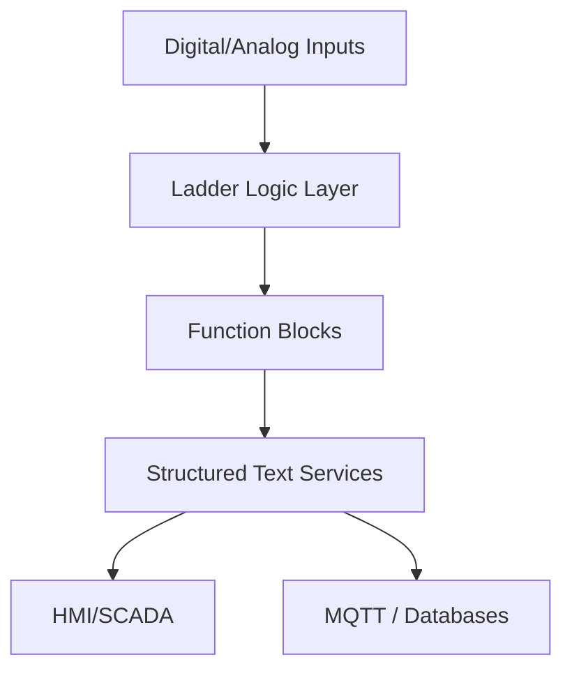

# Hybrid PLC Programming Techniques

Modern automation projects benefit from combining programming languages strategically. Ladder logic remains intuitive for operators, while structured text and function blocks bring modularity and integration. Here’s how I blend them to deliver maintainable PLC programs.

## 1. Define Language Boundaries

- **Ladder Logic (LD):** Interlocks, safety chains, and operator-facing sequences.
- **Function Block Diagram (FBD):** Reusable control algorithms (PID, motor control, PackML state models).
- **Structured Text (ST):** Data handling, recipe management, protocol parsers, and math-heavy routines.

Explicitly document which language handles which domain to avoid ambiguity when teams collaborate.

## 2. Architecture Blueprint



- Ladder handles deterministic machine states.
- Function blocks encapsulate equipment modules.
- Structured text manages data exchange and analytics hooks.

## 3. Example: Recipe Management in ST Feeding Ladder Sequences

```pascal
TYPE Recipe_t :
STRUCT
    Temperature : REAL;
    ConveyorSpeed : REAL;
    TargetCount : DINT;
END_STRUCT
END_TYPE

VAR_GLOBAL
    CurrentRecipe : Recipe_t;
    StartSequence : BOOL;
END_VAR

IF NewRecipeAvailable THEN
    CurrentRecipe := RecipeBuffer;
    StartSequence := TRUE;
END_IF;
```

Ladder logic monitors `StartSequence` to trigger interlocks and sequences, while structured text safely handles data parsing and validations.

## 4. Diagnostic Strategy

- Use ST to publish JSON payloads (`MQTT`, `REST`) that expose equipment states to IT systems.
- Add ladder rungs dedicated to health bits and heartbeat signals.
- Implement function blocks that capture execution metrics (cycle time, error codes) for historians.

## 5. Version Control and Collaboration

- Export projects as PLCopen XML or vendor-specific source files to store in Git.
- Establish code reviews where controls engineers and OT/IT specialists evaluate changes together.
- Automate linting with tools like PLC Checker or vendor-provided analyzers.

## 6. Training Operators and Maintenance

- Document which segments of code belong to ladder vs. structured text and provide quick reference guides.
- Build simulator projects so technicians can test modifications safely.
- Offer bilingual comments and naming conventions when working with multilingual teams.

## 7. Benefits Realized

- Faster change management because IT specialists can update data routines without touching core machine logic.
- Improved diagnostics with rich data published to MES/BI systems.
- Operators retain confidence because the primary sequences remain ladder-based and familiar.

Combining PLC languages thoughtfully turns automation systems into collaborative platforms where controls, IT, and analytics teams can iterate quickly while keeping machines safe and reliable.
