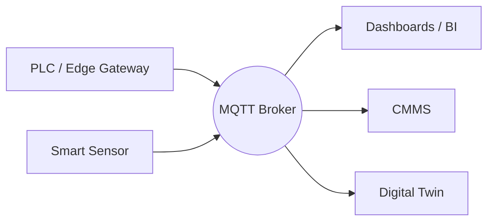

# MQTT Fundamentals: Publish/Subscribe, Brokers, and Clients

MQTT is my go-to protocol for connecting factory equipment to analytics platforms. Its publish/subscribe model decouples producers and consumers, making it ideal for bridging OT and IT. Here’s how the pieces fit together in real deployments.

## 1. Publish/Subscribe in Plain Terms

- **Publishers** send messages to topics (e.g., `plant/line1/oven`).
- **Subscribers** receive messages for the topics they care about.
- **Broker** sits in the middle, authenticating clients, handling routing, and retaining messages when needed.

Unlike request/response protocols, publishers and subscribers never need to know about each other, which simplifies scaling.

## 2. MQTT Architecture Diagram



## 3. Quality of Service (QoS)

- **QoS 0:** “At most once” – best effort. Use for non-critical telemetry.
- **QoS 1:** “At least once” – requires acknowledgment. Use for process values and alarms.
- **QoS 2:** “Exactly once” – two-phase handshake. Reserve for commands or financial transactions.

Choose QoS per topic based on criticality and network stability.

## 4. Client Implementation Example

```python
import json
from paho.mqtt.client import Client

client = Client(client_id="edge-line1")
client.tls_set("ca.pem", "edge.pem", "edge.key")
client.username_pw_set("line1", "pass")
client.connect("broker.plant", 8883)

client.publish("plant/line1/temperature", json.dumps({"value": 87.5}), qos=1)
client.subscribe("plant/line1/commands/#", qos=1)
```

## 5. Retained Messages and Last Will

- **Retained Messages:** Broker stores the last message on a topic. Ideal for dashboards that need the latest value immediately.
- **Last Will and Testament:** Configure clients to announce unexpected disconnects, allowing monitoring systems to alert maintenance.

## 6. Topic Design Tips

- Use hierarchical topics: `plant/line/station/parameter`.
- Reserve prefixes for system monitoring (`plant/line1/_sys/heartbeat`).
- Avoid spaces and keep topics lowercase for consistency.

## 7. Security Essentials

- Enforce TLS with client certificates.
- Use Access Control Lists (ACLs) to restrict topics per client.
- Rotate credentials and certificates periodically.
- Monitor connection counts and unusual publish rates to detect anomalies.

## 8. Scaling Strategies

- Deploy clustered brokers (HiveMQ, EMQX, Mosquitto with bridging) for redundancy.
- Use shared subscriptions to load balance consumers.
- Integrate with enterprise IAM for centralized user management.

## 9. Bridging OT and IT

Pair MQTT with edge gateways that normalize PLC data into structured payloads. Downstream services—dashboards, CMMS, machine learning—consume the same streams without custom point-to-point integrations.

MQTT’s simplicity hides its power. With disciplined topic design, QoS selection, and security controls, it becomes the backbone of resilient industrial IoT architectures.
