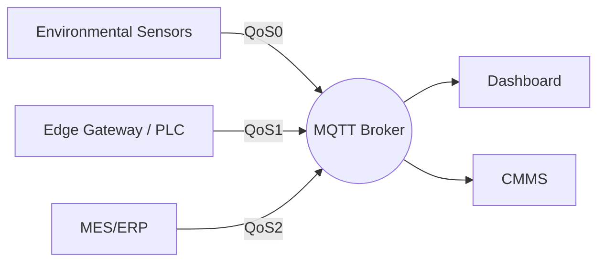

# MQTT QoS Levels Explained for Industrial IoT

Quality of Service (QoS) determines how MQTT guarantees message delivery. Selecting the right level keeps your data reliable without overloading networks or PLCs. Here’s how I apply QoS in production deployments.

## QoS 0 — At Most Once

- **Characteristics:** Fire-and-forget; no acknowledgment.
- **Use Cases:** Non-critical telemetry (ambient sensors, dashboards updating every few seconds).
- **Tips:** Combine with retained messages so new subscribers get the latest value instantly.

## QoS 1 — At Least Once

- **Characteristics:** Publisher waits for PUBACK; messages may be delivered more than once.
- **Use Cases:** Process values, alarms, OEE metrics, condition monitoring.
- **Tips:** Design subscribers to handle duplicates idempotently (check timestamps or sequence numbers).

## QoS 2 — Exactly Once

- **Characteristics:** Four-way handshake (PUBREC/PUBREL/PUBCOMP). Highest reliability with added latency.
- **Use Cases:** Critical commands (start/stop), recipe downloads, transactional updates to MES/ERP.
- **Tips:** Apply sparingly; excessive QoS 2 traffic can create bottlenecks on constrained gateways.

## Mixed QoS Architecture Example

## Performance Considerations

- Measure message latency and throughput during commissioning.
- Ensure MQTT clients are configured with appropriate inflight window sizes.
- Use persistent sessions when clients connect intermittently.

## Error Handling and Retries

- Implement exponential backoff for reconnection attempts.
- Log QoS failures and monitor broker statistics to catch issues early.
- Use Last Will messages so monitoring systems know when a client disappears unexpectedly.

## Security Alignment

Higher QoS does not replace security. Pair your QoS strategy with TLS encryption, ACLs, and certificate management to protect command topics from abuse.

The right QoS choice balances reliability, latency, and resource usage. Map each topic to the level it needs—no more, no less—and your MQTT infrastructure will stay responsive and resilient.
