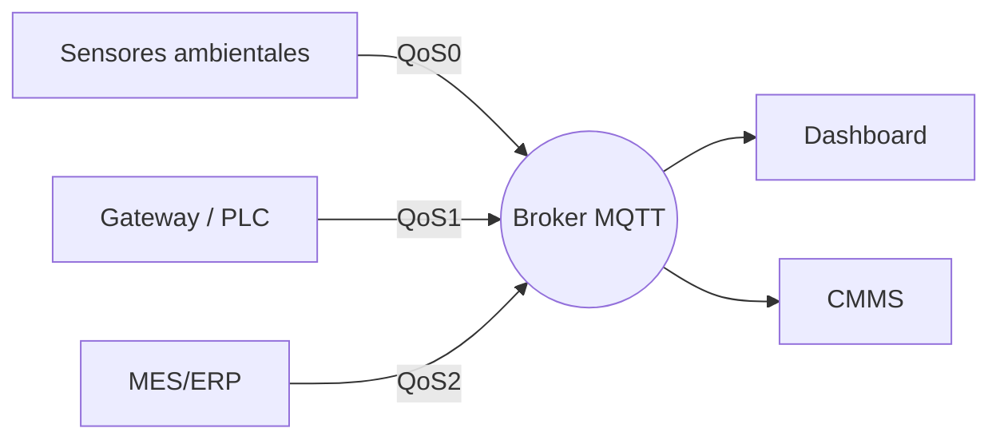

# Niveles QoS de MQTT explicados para IIoT

La Calidad de Servicio (QoS) define cómo MQTT garantiza la entrega de mensajes. Seleccionar el nivel adecuado mantiene tus datos confiables sin saturar redes ni PLC. Así aplico QoS en despliegues productivos.

## QoS 0 — Como máximo una vez

- **Características:** Fire-and-forget; sin acuse de recibo.
- **Usos:** Telemetría no crítica (sensores ambientales, dashboards que se actualizan cada segundos).
- **Consejos:** Combínalo con mensajes retenidos para que nuevos suscriptores obtengan el último valor al instante.

## QoS 1 — Al menos una vez

- **Características:** El publicador espera PUBACK; el mensaje puede entregarse más de una vez.
- **Usos:** Valores de proceso, alarmas, métricas OEE, monitoreo de condición.
- **Consejos:** Diseña los suscriptores para manejar duplicados de forma idempotente (validando timestamp o secuencias).

## QoS 2 — Exactamente una vez

- **Características:** Handshake de cuatro pasos (PUBREC/PUBREL/PUBCOMP). Máxima confiabilidad con más latencia.
- **Usos:** Comandos críticos (start/stop), descargas de recetas, actualizaciones transaccionales a MES/ERP.
- **Consejos:** Úsalo con moderación; demasiado tráfico QoS 2 puede generar cuellos de botella en gateways limitados.

## Arquitectura con QoS mixto

## Consideraciones de desempeño

- Mide latencia y throughput durante la puesta en marcha.
- Asegura que los clientes MQTT tengan ventanas inflight acordes al tráfico.
- Usa sesiones persistentes cuando los clientes se conectan de forma intermitente.

## Manejo de errores y reintentos

- Implementa backoff exponencial para reconexiones.
- Registra fallos de QoS y monitorea estadísticas del broker para detectar problemas temprano.
- Configura mensajes Last Will para que los sistemas de monitoreo detecten desconexiones inesperadas.

## Alineación con seguridad

Un QoS alto no reemplaza la seguridad. Complementa tu estrategia con cifrado TLS, ACL y gestión de certificados para proteger los tópicos de comando.

La elección correcta equilibra confiabilidad, latencia y uso de recursos. Asigna a cada tópico el nivel que necesita—ni más ni menos—y tu infraestructura MQTT se mantendrá receptiva y resiliente.
