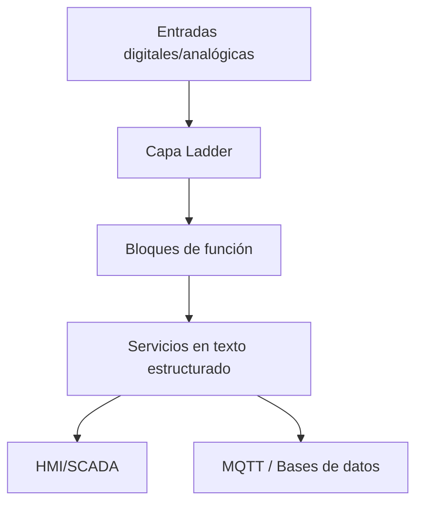

# Técnicas de programación híbrida para PLC

Los proyectos modernos se benefician de combinar lenguajes estratégicamente. Ladder sigue siendo intuitivo para operadores, mientras que el texto estructurado y los bloques de función aportan modularidad e integración. Así los mezclo para entregar programas de PLC mantenibles.

## 1. Define límites de lenguaje

- **Ladder (LD):** Interlocks, cadenas de seguridad y secuencias orientadas al operador.
- **Function Block Diagram (FBD):** Algoritmos reutilizables (PID, control de motores, modelos PackML).
- **Structured Text (ST):** Manejo de datos, gestión de recetas, parsers de protocolos y rutinas matemáticas.

Documenta explícitamente qué dominio cubre cada lenguaje para evitar ambigüedades cuando colaboran varios equipos.

## 2. Plano de arquitectura



- Ladder controla los estados deterministas de la máquina.
- Los bloques de función encapsulan módulos de equipo.
- El texto estructurado gestiona el intercambio de datos y los ganchos de analítica.

## 3. Ejemplo: recetas en ST que alimentan secuencias ladder

```pascal
TYPE Recipe_t :
STRUCT
    Temperature : REAL;
    ConveyorSpeed : REAL;
    TargetCount : DINT;
END_STRUCT
END_TYPE

VAR_GLOBAL
    CurrentRecipe : Recipe_t;
    StartSequence : BOOL;
END_VAR

IF NewRecipeAvailable THEN
    CurrentRecipe := RecipeBuffer;
    StartSequence := TRUE;
END_IF;
```

El ladder monitorea `StartSequence` para disparar interlocks y secuencias, mientras que el texto estructurado se encarga de parsear y validar datos.

## 4. Estrategia de diagnóstico

- Usa ST para publicar payloads JSON (`MQTT`, `REST`) que expongan estados hacia sistemas IT.
- Añade rungs dedicados a bits de salud y señales de latido.
- Implementa bloques de función que capturen métricas de ejecución (tiempo de ciclo, códigos de error) para historiadores.

## 5. Control de versiones y colaboración

- Exporta proyectos como PLCopen XML o fuentes del fabricante para almacenarlos en Git.
- Establece revisiones conjuntas entre ingenieros de control y especialistas OT/IT.
- Automatiza linters con PLC Checker u otras herramientas del proveedor.

## 6. Formación para operadores y mantenimiento

- Documenta qué segmentos corresponden a ladder y cuáles a texto estructurado; incluye guías rápidas.
- Construye proyectos simulados para que los técnicos prueben cambios sin riesgo.
- Utiliza comentarios bilingües y nomenclaturas consistentes cuando trabajas con equipos multilingües.

## 7. Beneficios logrados

- Gestión de cambios más ágil porque TI puede ajustar rutinas de datos sin tocar la lógica principal.
- Diagnósticos enriquecidos gracias a datos publicados hacia MES/BI.
- Los operadores mantienen confianza al ver que las secuencias principales siguen en ladder.

Al combinar los lenguajes de PLC con intención, la automatización se convierte en una plataforma colaborativa donde control, TI y analítica iteran con seguridad sin sacrificar la fiabilidad de la máquina.
