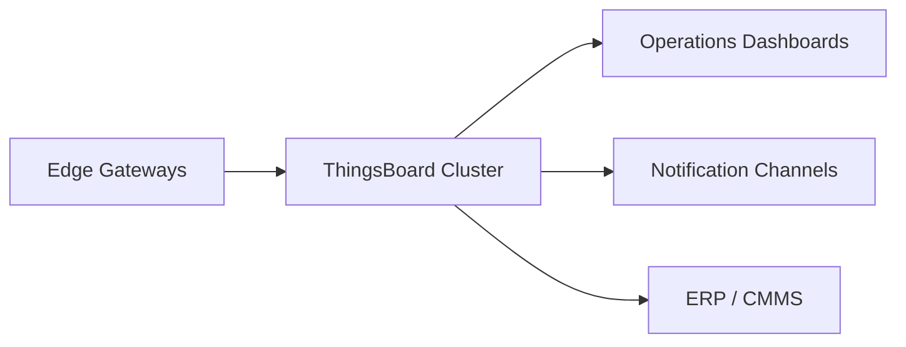

# Getting the Most from ThingsBoard in Industrial IoT

ThingsBoard is a flexible platform for industrial IoT, but real success depends on disciplined configuration and integration. Here’s how I set it up to support production environments.

## 1. Architecture Overview

- Deploy ThingsBoard in a clustered configuration (Kubernetes or Docker Compose with HA) for resilience.
- Use PostgreSQL + TimescaleDB for telemetry storage and Redis for queues.

## 2. Device and Asset Modeling

- Represent plants, lines, and machines using ThingsBoard asset hierarchies.
- Ingest telemetry via MQTT, HTTP, or OPC UA connectors.
- Use server-side attributes to store metadata (location, maintenance owner, firmware versions).

## 3. Dashboards Operators Love

- Create role-based dashboards: operations, maintenance, quality.
- Combine widgets: trend charts, alarm tables, KPI cards, floor plan maps.
- Add multilingual labels and unit conversions for international teams.

## 4. Alarm Strategy

- Define alarm rules with severity levels and escalation paths.
- Integrate with email, SMS, MS Teams, or Slack via rule chains.
- Auto-close alarms when conditions clear and log acknowledgements.

## 5. Rule Chains for Automation

- Normalize payloads, apply calculations (OEE, energy intensity), and route data to external systems.
- Trigger work orders in CMMS when certain thresholds are exceeded.
- Use script nodes (JavaScript) for custom logic, but keep reusable code in source control.

## 6. Security Hardening

- Enforce JWT expiration and refresh policies.
- Segment tenant administrators and device credentials.
- Enable auditing to track configuration changes.
- Use reverse proxies with TLS termination and Web Application Firewall (WAF) capabilities.

## 7. Integration Tips

- Connect to Power BI, Grafana, or data lakes using REST APIs or the built-in integration toolkit.
- Synchronize asset hierarchies with ERP/MES systems to maintain consistent naming.
- Export dashboards and rule chains to Git for version control.

## 8. Operational Playbook

- Monitor infrastructure (CPU, memory, queue lengths) and set up alerts.
- Schedule backups of PostgreSQL and Redis; test restoration regularly.
- Train operators on acknowledging alarms and interpreting KPIs.

With thoughtful architecture and governance, ThingsBoard becomes more than a dashboard—it becomes the nerve center for your industrial IoT initiative.
