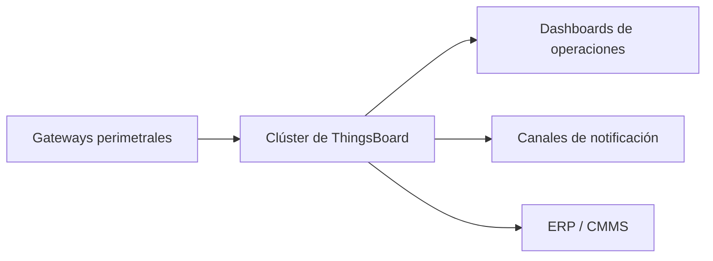

# Cómo sacar el máximo provecho de ThingsBoard en IIoT

ThingsBoard es una plataforma flexible para IIoT industrial, pero el éxito real depende de configurar e integrar con disciplina. Así es como la preparo para entornos productivos.

## 1. Visión de arquitectura

- Despliega ThingsBoard en configuración clusterizada (Kubernetes o Docker Compose con HA) para lograr resiliencia.
- Usa PostgreSQL + TimescaleDB para almacenamiento de telemetría y Redis para colas.

## 2. Modelado de dispositivos y activos

- Representa plantas, líneas y máquinas con las jerarquías de activos de ThingsBoard.
- Ingresa telemetría vía conectores MQTT, HTTP u OPC UA.
- Usa atributos del lado del servidor para guardar metadatos (ubicación, responsable de mantenimiento, versiones de firmware).

## 3. Dashboards que encantan a los operadores

- Crea dashboards por rol: operaciones, mantenimiento, calidad.
- Combina widgets: gráficos de tendencias, tablas de alarmas, tarjetas KPI, mapas del layout.
- Añade etiquetas multilingües y conversiones de unidades para equipos internacionales.

## 4. Estrategia de alarmas

- Define reglas de alarma con niveles de severidad y rutas de escalamiento.
- Integra correo, SMS, MS Teams o Slack mediante rule chains.
- Cierra alarmas automáticamente cuando se normalizan las condiciones y registra las confirmaciones.

## 5. Rule chains para automatización

- Normaliza payloads, aplica cálculos (OEE, intensidad energética) y enruta datos a sistemas externos.
- Dispara órdenes de trabajo en el CMMS cuando se exceden ciertos umbrales.
- Usa nodos de script (JavaScript) para lógica personalizada, pero conserva el código reutilizable en control de versiones.

## 6. Endurecimiento de seguridad

- Refuerza las políticas de expiración y renovación de tokens JWT.
- Separa credenciales de administradores de tenant y de dispositivos.
- Habilita auditoría para rastrear cambios de configuración.
- Emplea proxys inversos con terminación TLS y capacidades WAF.

## 7. Consejos de integración

- Conecta con Power BI, Grafana o data lakes mediante APIs REST o el toolkit de integraciones.
- Sincroniza jerarquías de activos con ERP/MES para mantener nomenclatura consistente.
- Exporta dashboards y rule chains a Git para control de versiones.

## 8. Manual operativo

- Monitorea la infraestructura (CPU, memoria, longitud de colas) y configura alertas.
- Agenda respaldos de PostgreSQL y Redis; prueba restauraciones con regularidad.
- Capacita a operadores en reconocimiento de alarmas e interpretación de KPIs.

Con una arquitectura y gobernanza cuidadosas, ThingsBoard se convierte en mucho más que un dashboard: es el centro nervioso de tu iniciativa IIoT industrial.
